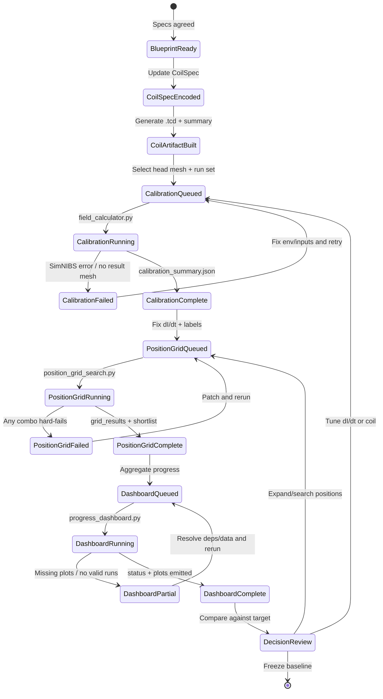
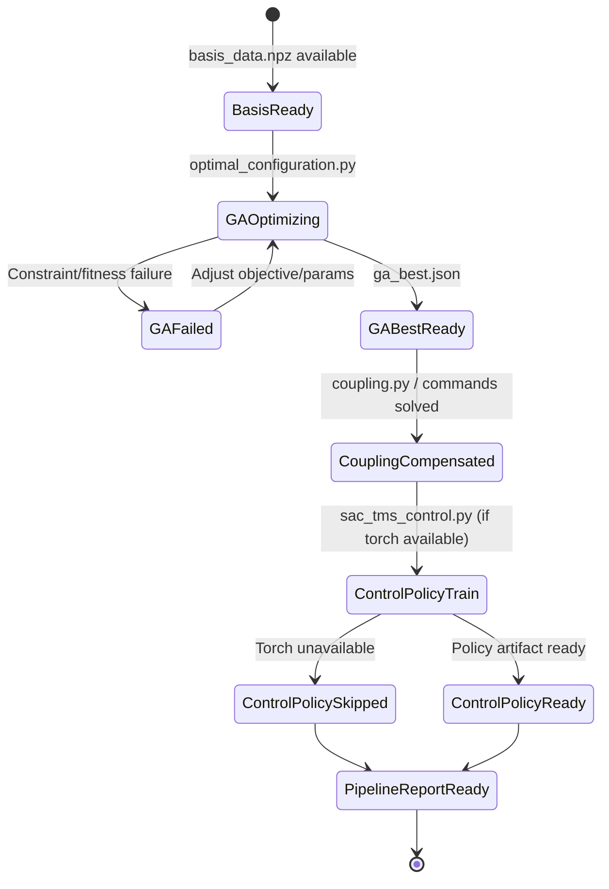

# System State Diagram (SimNIBS + Deep Targeting)

## Purpose
This document defines the operational state machine for the Omnidream simulation stack so future work can quickly determine:
- current system state,
- expected artifacts,
- valid next transitions,
- failure recovery path.

## Scope
Applies to:
- coil build and calibration (`custom_c_shaped_coil.py`, `field_calculator.py`)
- position sweeps (`position_grid_search.py`)
- reporting (`progress_dashboard.py`)
- deep-targeting pipeline outputs (TI/NTS/hybrid, when present).

## State Machine A: SimNIBS Execution Lifecycle

## State Machine B: Deep Targeting Pipeline (Optional Layer)

## State Definitions and Artifacts
| State | Entry Condition | Exit Artifact(s) | Primary Script(s) |
|---|---|---|---|
| `CoilArtifactBuilt` | Coil spec chosen | `coil_models/c_shaped_miniature_v1.tcd`, `coil_models/c_shaped_miniature_v1.summary.json` | `custom_c_shaped_coil.py` |
| `CalibrationComplete` | Sweep or single run finished | `simulations/**/calibration_summary.json`, `sweep_metrics.csv`, run-level `metrics.json` | `field_calculator.py` |
| `PositionGridComplete` | Position combos evaluated | `simulations/position_grid/*/grid_results.json`, `shortlist.json`, `events.ndjson`, `status.json` | `position_grid_search.py` |
| `DashboardComplete` | Aggregation succeeds | `monitoring/project_status.json`, `monitoring/position_status.json`, plot `.png` files | `progress_dashboard.py` |
| `PipelineReportReady` | GA + optional SAC stage complete | `pipeline_output/pipeline_summary.json`, `ga_best.json`, optional SAC artifacts | `run_pipeline.py`, `sac_tms_control.py` |

## Operational Notes
- SimNIBS environment version is state-critical. Mixing versions can create `CalibrationFailed` despite valid inputs.
- `DashboardComplete` depends on available run artifacts; missing/partial simulation sessions produce `DashboardPartial`.
- `monitoring/` is generated output, not a source directory; it may not exist until dashboard execution.

## Recommended Recovery Checklist
1. Confirm SimNIBS Python path and version.
2. Verify head mesh and coil artifact paths exist.
3. Re-run the last failed state only (do not restart from scratch unless inputs changed).
4. Confirm expected artifact for that state before moving forward.

## Related Documents
- `Blueprints/simnibs_miniature_tms_implementation_plan.md`
- `Blueprints/deep_targeting_formulations.md`
- `Blueprints/systematic_implementation_plan.md`
- `Blueprints/final_build_constraints.md`
