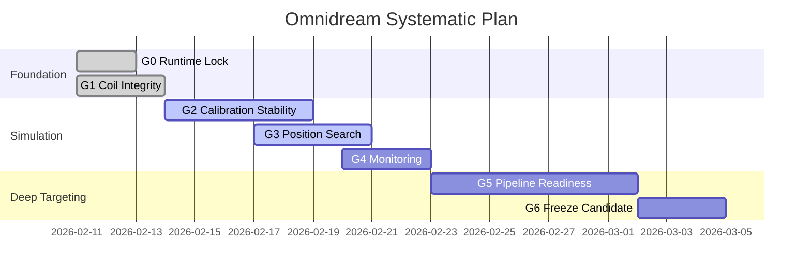

# Systematic Implementation Plan

## Objective
Deliver a reproducible, monitored, and test-gated pipeline for miniature-coil SimNIBS simulation and deep-targeting optimization (TI, NTS, hybrid), with clear entry/exit criteria at each stage.

## Baseline Snapshot (As of February 11, 2026)
- Coil artifact exists: `coil_models/c_shaped_miniature_v1.tcd` and `coil_models/c_shaped_miniature_v1.summary.json`.
- Calibration sessions exist: `simulations/calibration_ernie*/**/calibration_summary.json`.
- Position grid results exist: `simulations/position_grid/grid_ernie_20260210_02/grid_results.json` and `shortlist.json`.
- Core modules and tests exist: `run_pipeline.py`, `optimal_configuration.py`, `sac_tms_control.py`, `tests/test_all.py`.
- Monitoring directory is generated output and may need regeneration (`progress_dashboard.py`).

## Success Criteria
- `S1`: Reproducible coil build and checksum-tracked artifacts.
- `S2`: Stable SimNIBS calibration with no hard-failure runs in standard sweep.
- `S3`: Position search produces ranked shortlist with explicit error-to-target metrics.
- `S4`: Dashboard publishes JSON + Markdown + plots from latest data.
- `S5`: TI/NTS/hybrid pipeline runs end-to-end in synthetic mode; real-basis mode runs through optimization.
- `S6`: Gate checks (tests + smoke runs) pass before baseline freeze.

## Workstreams
| ID | Workstream | Goal | Primary Files |
|---|---|---|---|
| `WS1` | Environment and Reproducibility | Pin and verify runtime/tooling versions | `Blueprints/system_state_diagram.md` |
| `WS2` | Coil Modeling | Keep coil geometry generation deterministic | `custom_c_shaped_coil.py`, `coil_models/*` |
| `WS3` | SimNIBS Calibration | Maintain robust field metric extraction and calibration runs | `field_calculator.py`, `simulations/calibration_*` |
| `WS4` | Position Optimization | Rank stimulation positions against target E-field | `position_grid_search.py`, `simulations/position_grid/*` |
| `WS5` | Monitoring and Reporting | Publish progress/status artifacts and plots | `progress_dashboard.py`, `monitoring/*` |
| `WS6` | Deep Targeting Pipeline | Execute TI/NTS/hybrid optimization and controls | `run_pipeline.py`, `optimal_configuration.py`, `sac_tms_control.py` |
| `WS7` | Verification and Release | Keep tests/smoke checks as release gates | `tests/test_all.py` |

## Phase Gates

### Gate G0: Runtime Lock
- Entry: Planning approved.
- Actions:
1. Record SimNIBS Python path and version.
2. Verify required scripts import cleanly.
- Exit Evidence:
1. Documented runtime path in session notes.
2. No import errors for core scripts.

### Gate G1: Coil Artifact Integrity
- Entry: Runtime locked.
- Actions:
1. Generate coil artifact from `custom_c_shaped_coil.py`.
2. Verify summary dimensions/turn count.
- Exit Evidence:
1. `.tcd` + `.summary.json` produced.
2. Summary reports expected turns and sane bounds.

### Gate G2: Calibration Stability
- Entry: Coil artifact validated.
- Actions:
1. Run dI/dt sweep with `field_calculator.py`.
2. Confirm `calibration_summary.json` and per-run `metrics.json` outputs.
3. Confirm error handling leaves diagnosable artifacts on failure.
- Exit Evidence:
1. Calibration summary exists.
2. Target-proximity run identified (for `E_max` objective).

### Gate G3: Position Search and Shortlist
- Entry: Calibrated dI/dt selected.
- Actions:
1. Run `position_grid_search.py` over selected EEG label sets.
2. Produce `grid_results.json`, `grid_results.csv`, `shortlist.json`, `shortlist.md`.
- Exit Evidence:
1. `status.json` shows 100% combo completion.
2. Ranked shortlist produced with absolute and relative error metrics.

### Gate G4: Monitoring Publication
- Entry: Calibration and/or position artifacts available.
- Actions:
1. Run `progress_dashboard.py`.
2. Publish status markdown/json and plots into `monitoring/`.
- Exit Evidence:
1. `project_status.json` and `position_status.json` exist.
2. Core plots emitted (`emax_vs_didt`, `abs_error_vs_didt`, position plots).

### Gate G5: Deep Targeting Pipeline Readiness
- Entry: Field pipeline stable.
- Actions:
1. Run `run_pipeline.py` in synthetic mode for TI/NTS/hybrid.
2. Run real-basis mode where feasible.
3. Run SAC stage when torch is available; otherwise record intentional skip.
- Exit Evidence:
1. Pipeline summary artifacts emitted.
2. Mode-specific metrics generated in dashboard when pipeline outputs exist.

### Gate G6: Freeze Candidate
- Entry: Gates G1-G5 complete.
- Actions:
1. Run tests and smoke checks.
2. Update docs and lock baseline outputs.
- Exit Evidence:
1. Test suite pass/skip profile recorded.
2. Baseline tag/candidate package ready for next research iteration.

## Execution Timeline (Suggested)


## Runbook Commands
Use the SimNIBS 4.5 environment for coil/simulation stages:

```bash
SIMNIBS_PY=/Users/ajithsenthil/Applications/SimNIBS-4.5/simnibs_env/bin/python3
cd /Users/ajithsenthil/Desktop/FQ_pitch_materials/RulialSynchronyMatrix/Omnidream

# G1: Coil artifact
$SIMNIBS_PY custom_c_shaped_coil.py

# G2: Calibration sweep
$SIMNIBS_PY field_calculator.py --head-mesh /ABS/PATH/TO/subject.msh --sweep-didt "2e8,4e8,6e8,7e8,8e8"

# G3: Position grid search
$SIMNIBS_PY position_grid_search.py --head-mesh /ABS/PATH/TO/subject.msh --didt 6.874790356e8

# G4: Monitoring
python3 progress_dashboard.py --sim-root ./simulations --out-dir ./monitoring

# G5: Pipeline synthetic smoke
python3 run_pipeline.py --mode TI --synthetic --generations 10 --sac-episodes 5
python3 run_pipeline.py --mode NTS --synthetic --generations 10 --sac-episodes 5
python3 run_pipeline.py --mode hybrid --synthetic --generations 10 --sac-episodes 5

# G6: Test gate
python3 -m pytest tests/test_all.py -v
```

## Metrics to Track
- Field-target error: `abs(E_max - target_e_vpm)` per run.
- Position hit rate: fraction of position combos within tolerance.
- Run reliability: failed runs / total runs.
- Optimization convergence: best GA fitness over generations.
- Safety proxies: surface maxima, per-pulse maxima, SAR proxies from pipeline metrics.

## Risk Register
| Risk | Impact | Mitigation |
|---|---|---|
| SimNIBS version mismatch | Calibration/search failures | Always run with pinned SimNIBS 4.5 path |
| Missing result mesh in a run | Broken batch continuity | Keep run-level logs + retry from failed state |
| Sparse position coverage | Weak shortlist quality | Expand EEG label grid and rerank |
| Torch unavailable | SAC stage not executed | Treat as optional gate; record explicit skip reason |
| Human vs rodent interpretation drift | Invalid scientific conclusions | Keep replication mode and translational mode separate |

## Document Map
- State transitions and failure handling: `Blueprints/system_state_diagram.md`
- SimNIBS-specific implementation details: `Blueprints/simnibs_miniature_tms_implementation_plan.md`
- TI/NTS mathematical objectives and constraints: `Blueprints/deep_targeting_formulations.md`
- Final numeric limits for build/release: `Blueprints/final_build_constraints.md`
