# Omnidream

Research framework for **miniature multi-coil TMS** design, simulation, optimization, control, and perceptual-manifold analysis.

Omnidream combines:

- SimNIBS-based electromagnetic field simulation for custom miniature coils
- TI/NTS/hybrid stimulation optimization (GA + optional SAC)
- Safety-constrained control analysis (SAR, thermal, current, voltage)
- Computational Psychodynamics bridge (many-worlds energy/phi/probability analysis)
- Trajectory planning through world states
- Differential-geometric atlas over perceptual outcomes
- Progress monitoring, automation scripts, and frontend-ready data export

## Why this exists

This repository is built to answer a practical systems question:

How do we go from a **physical miniature coil design** to a **validated stimulation control policy** that can be navigated in outcome space, not just amplitude space?

The codebase is organized to preserve this end-to-end chain:

1. Coil geometry and SimNIBS field simulation
2. Basis-field modeling and coupling-aware circuit abstraction
3. Multi-objective optimization and safety gating
4. Control-theoretic sensitivity and reachability analysis
5. CP many-worlds mapping
6. World-to-world trajectory synthesis
7. Atlas construction over the perceptual manifold

## Visual intuition

### Fast picture first (non-technical)

| Big picture | Safety guardrails |
|---|---|
| 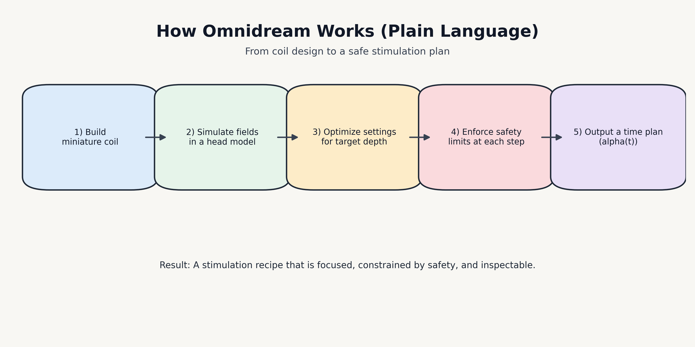 | 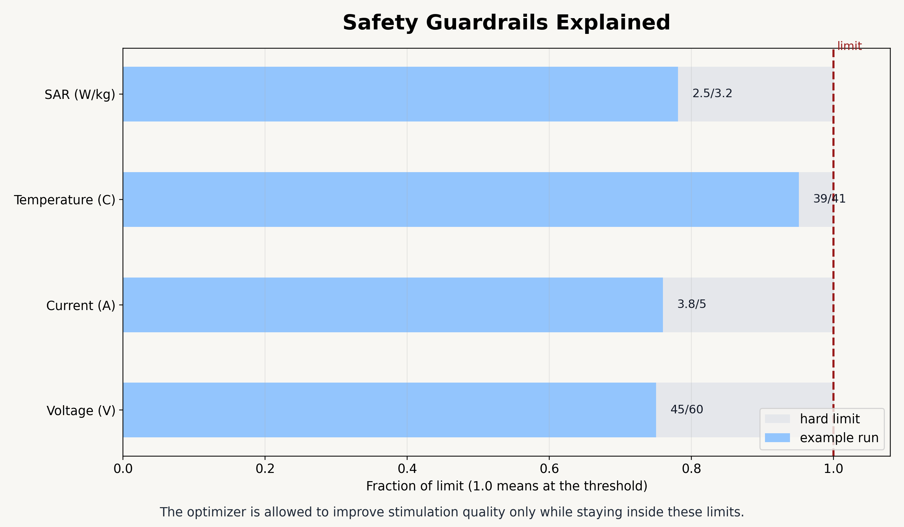 |

| Many worlds to one path | Typical day workflow |
|---|---|
| 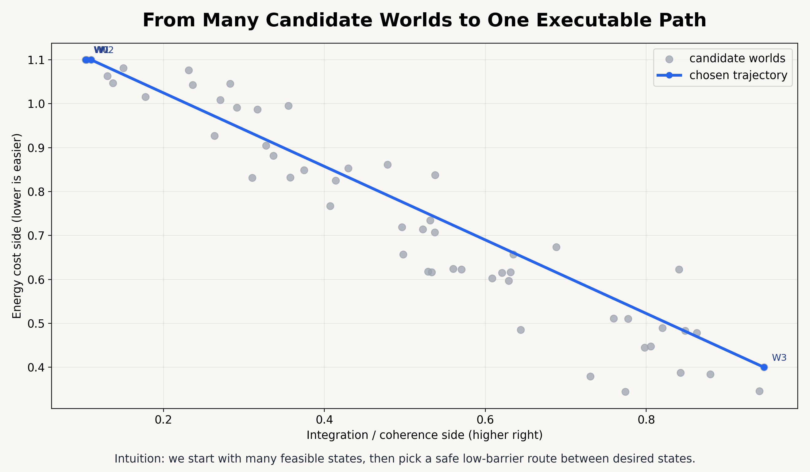 | 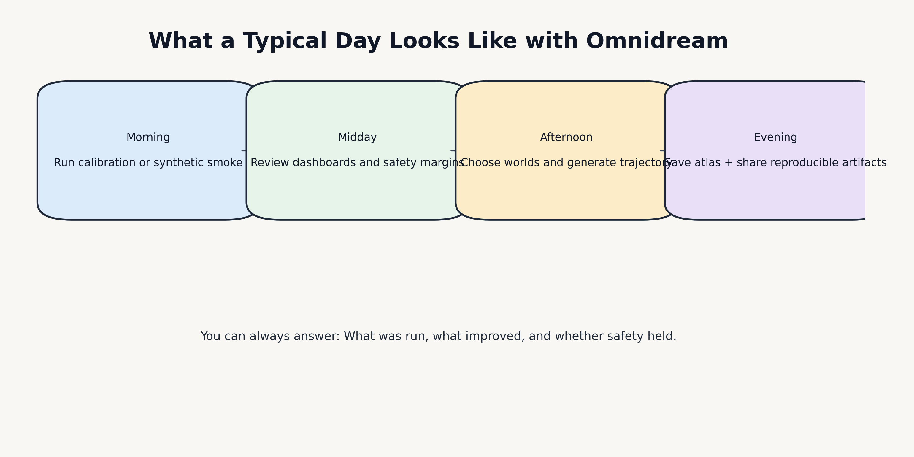 |

You can regenerate these plain-language figures with:

```bash
python3 scripts/generate_readme_images.py
```

### Technical architecture diagram

```mermaid
flowchart LR
  A["Miniature Coil Model (.tcd)"] --> B["SimNIBS Field Simulation"]
  B --> C["Basis Matrix E(x, coil)"]
  C --> D["Coupling + Plant Model"]
  D --> E["Optimization (GA / SAC)"]
  E --> F["Safety Gating (SAR, Thermal, Current, Voltage)"]
  F --> G["CP Bridge (World States)"]
  G --> H["Trajectory Planner"]
  H --> I["Perceptual Atlas"]
  I --> J["Executable alpha(t) + Reports"]
```

### Pipeline stage map

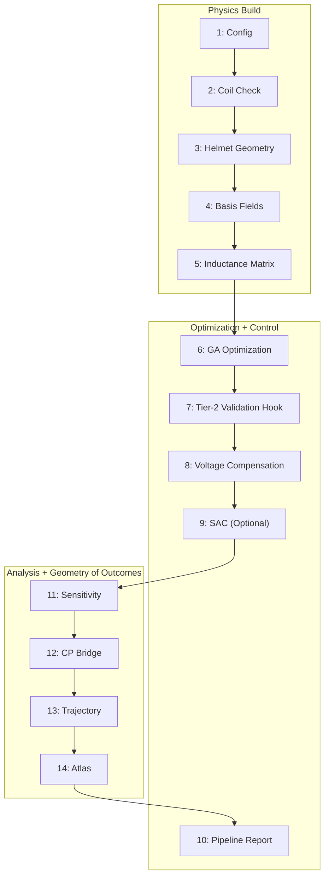

### Control loop intuition

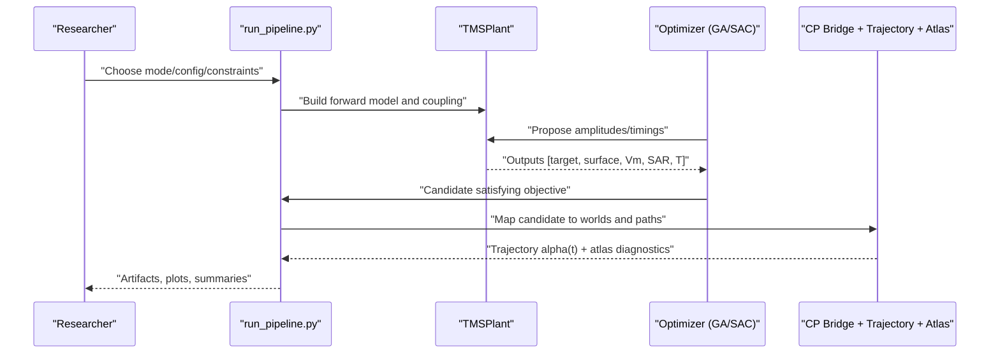

### World-to-trajectory-to-atlas intuition

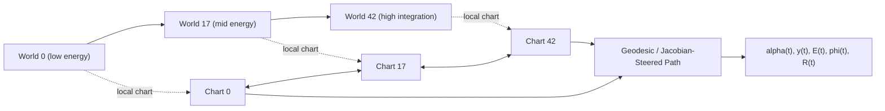

### Empirical calibration intuition (from `monitoring/`)

| Calibration scaling | Error convergence |
|---|---|
| 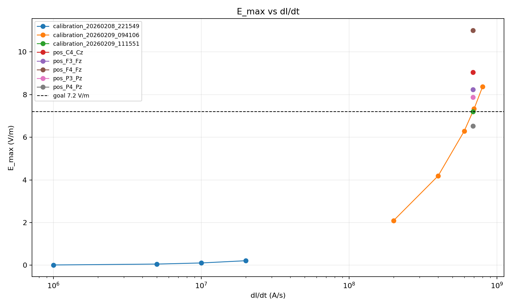 |  |

| Absolute error landscape | Position-level run density |
|---|---|
| 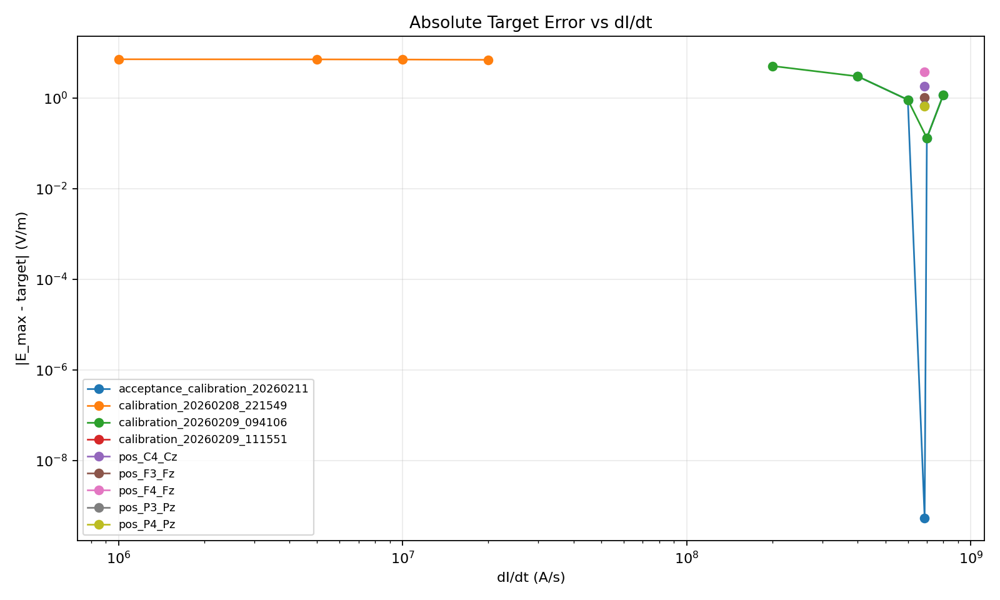 | 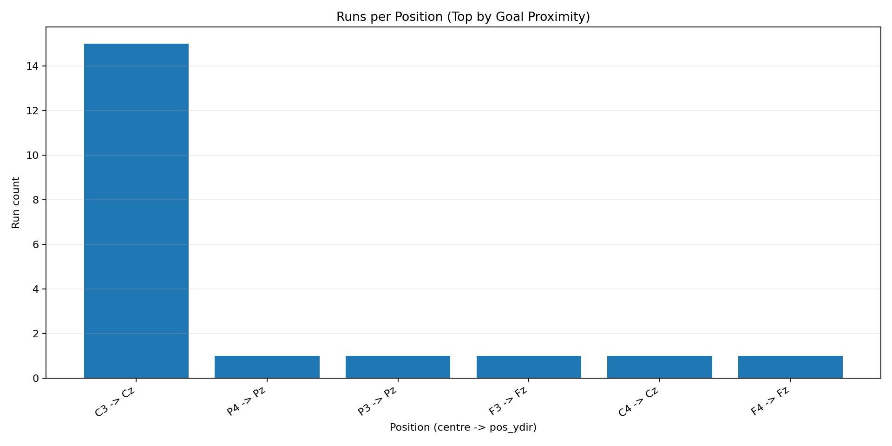 |

| Best error by position | Best Emax by position |
|---|---|
| 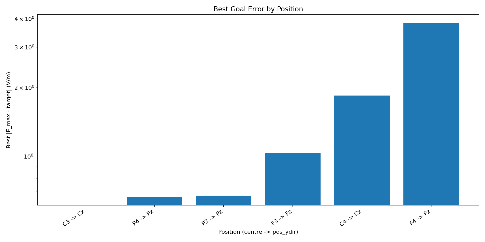 | 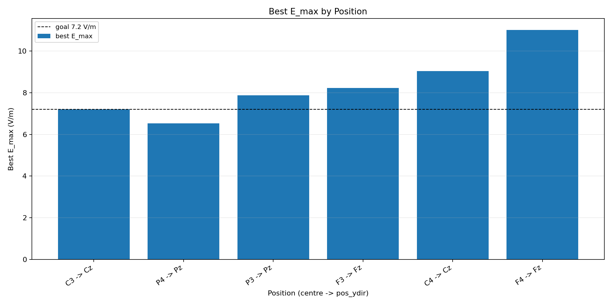 |

### Refresh visual assets

```bash
scripts/run_dashboard_refresh.sh
python3 progress_dashboard.py --sim-root simulations --out-dir monitoring --pipeline-dir pipeline_output
python3 scripts/generate_readme_images.py
```

## Scientific scope

Primary stimulation paradigms:

- **TI (Temporal Interference)**
- **NTS (Neural Temporal Summation)**
- **Hybrid TI+NTS**

Primary model outputs (5-vector):

- target metric
- surface/off-target metric
- membrane metric
- SAR max
- temperature max

Primary safety limits (defaults in `config.py`):

- SAR: `3.2 W/kg`
- temperature (continuous critical): `41 C`
- max current: `5 A`
- max voltage: `60 V`

## Repository map

- `run_pipeline.py`: 14-stage end-to-end orchestrator
- `config.py`: unified dataclass config (`OmnidreamConfig`)
- `custom_c_shaped_coil.py`: miniature C-shaped coil generator (`.tcd`)
- `field_calculator.py`: SimNIBS simulation + dI/dt calibration sweeps
- `helmet_geometry.py`: spherical-cap helmet placement with spacing constraints
- `basis_fields.py`: basis E-field generation/loading
- `coupling.py`: inductance/impedance/coupling compensation
- `optimal_configuration.py`: GA optimization for TI/NTS/hybrid
- `sac_tms_control.py`: optional SAC training environments
- `control_framework.py`: plant/controller abstractions and analysis
- `sensitivity.py`: Jacobians, Hessians, reachable sets, Pareto fronts
- `cp_bridge.py`: many-worlds/energy/phi/sync/MORL bridge
- `trajectory.py`: world-sequence/property/energy-descent planning
- `atlas.py`: perceptual manifold charts, transitions, topology, geodesics
- `progress_dashboard.py`: monitoring plots + status reports
- `scripts/`: automation entrypoints for long runs and exports
- `monitoring/frontend/`: typed schema + loaders for React dashboards
- `Blueprints/`: formulation docs, derivations, system planning material
- `tests/`: unit + integration tests

## 14-stage pipeline

Pipeline entrypoint: `python3 run_pipeline.py ...`

| Stage | Purpose | Key artifact(s) |
|---|---|---|
| 1 | Load/save config | `config_used.yaml` |
| 2 | Coil model check | coil availability checks |
| 3 | Helmet placement | `helmet_positions.npy`, `helmet_orientations.npy` |
| 4 | Basis fields | `basis_data.npz` |
| 5 | Inductance matrix | `inductance_matrix.npy` |
| 6 | GA optimization | `ga_best.json`, `ga_history.json` |
| 7 | Tier-2 validation hook | (placeholder/flow integration) |
| 8 | Coupling-compensated voltages | `voltage_commands.json` |
| 9 | SAC training (optional PyTorch) | `sac_history.json` |
| 10 | Pipeline summary report | `pipeline_summary.json` |
| 11 | Sensitivity/control analysis | `sensitivity_analysis.npz`, `sensitivity_summary.txt` |
| 12 | CP bridge analysis | `cp_bridge_analysis.npz`, `cp_bridge_summary.txt` |
| 13 | Trajectory planning | `trajectory_result.npz`, `trajectory_summary.txt` |
| 14 | Perceptual atlas | `atlas_result.npz`, `atlas_summary.txt` |

Notes:

- Stage order in source code keeps Stage 10 near the end, but execution is still keyed by stage index.
- Stage 9 is skipped gracefully if `torch` is unavailable.

## Install and environment

### Core Python

Use Python 3.10+.

Install common dependencies:

```bash
python3 -m pip install numpy scipy matplotlib pyyaml pytest
```

### Optional dependencies

- **PyTorch** for Stage 9 SAC:

```bash
python3 -m pip install torch
```

- **SimNIBS** for real-field simulation:
  - run SimNIBS scripts with the SimNIBS Python interpreter
  - `field_calculator.py` and `custom_c_shaped_coil.py` fail fast if SimNIBS is missing

## Quickstart

### 1) Synthetic end-to-end smoke (no SimNIBS required)

```bash
python3 run_pipeline.py \
  --mode TI \
  --synthetic \
  --num-coils 16 \
  --pop-size 10 \
  --generations 10 \
  --sac-episodes 5 \
  --output-dir pipeline_output/TI_smoke
```

### 2) Multi-mode architecture smoke + tests

```bash
scripts/run_architecture_smoke.sh
```

This runs TI/NTS/hybrid synthetic pipelines and a test gate.

### 3) Build monitoring outputs

```bash
python3 progress_dashboard.py \
  --sim-root simulations \
  --out-dir monitoring \
  --pipeline-dir pipeline_output/TI_smoke
```

### 4) Export NPZ artifacts to frontend JSON

```bash
python3 scripts/export_pipeline_npz.py \
  --pipeline-dir pipeline_output/TI_smoke \
  --pretty
```

## SimNIBS workflow (real-field)

### Generate/update coil model

```bash
/path/to/simnibs/python custom_c_shaped_coil.py \
  --output coil_models/c_shaped_miniature_v1.tcd
```

### Single calibration/simulation run

```bash
scripts/run_single_simnibs_case.sh \
  --centre C3 \
  --pos-ydir Cz \
  --didt 6.874790356e8
```

### Calibration sweeps and grid search

```bash
scripts/run_calibration_search.sh
scripts/run_position_grid_search.sh
scripts/run_dashboard_refresh.sh
```

### One-command long-run orchestration

```bash
scripts/run_v1_full.sh
```

## Trajectory + atlas capabilities

### Trajectory planning (`trajectory.py`)

Supports:

- `world_sequence`: explicit world ID path
- `property_sequence`: target path in `(phi, sync_R[, energy])`
- `energy_descent`: minimax-barrier path over world graph

Interpolation methods:

- `linear`
- `geodesic` (sampled low-barrier selection)
- `jacobian_steered` (pseudoinverse steering in output space)

Constraint handling:

- per-timestep SAR/thermal/current/voltage checks
- strict/permissive safety mode
- optional H-theorem consistency correction
- implacement event tracking and delta-phi accounting

### Perceptual atlas (`atlas.py`)

Builds a differential-geometric atlas over perceptual outcome space:

- local chart per world: output Jacobian, perceptual Jacobian, SVD, metric tensor, Hessian
- transition maps with perceptual distance and energy barrier
- topology summary (components, boundary charts, effective dimensions)
- geodesic search over chart graph
- adaptive densification in sparse/high-curvature regions

## Monitoring and visualization

`progress_dashboard.py` produces:

- project + position status JSON/Markdown
- calibration convergence plots
- runs/session and runs/position distributions
- pipeline-mode metrics and CP/trajectory/atlas summaries when available

Frontend data contract:

- `monitoring/frontend/omnidreamDataSchema.ts`
- `monitoring/frontend/omnidreamDataLoader.ts`

React component prototype:

- `omnidream_viz.jsx`

## Reproducibility artifacts

Typical pipeline output bundle (`pipeline_output/<run_name>/`):

- config snapshot
- basis fields
- GA best/history
- coupling-compensated voltage commands
- sensitivity NPZ + summary
- CP bridge NPZ + summary
- trajectory NPZ + summary
- atlas NPZ + summary
- pipeline summary JSON

The `scripts/export_pipeline_npz.py` converter writes frontend-safe JSON under `pipeline_output/<run_name>/web/`.

## Testing

Run all tests:

```bash
pytest -q
```

Current repository baseline used in recent integration cycle:

- `199 passed`

Targeted test files include:

- `tests/test_all.py`
- `tests/test_control_framework.py`
- `tests/test_cp_bridge.py`
- `tests/test_trajectory.py`
- `tests/test_atlas.py`

## Safety and use boundaries

This repository is for **research and simulation development**.

- It is **not** a clinical system.
- Safety checks are model-based and do not substitute hardware validation, regulatory review, or human-subject safeguards.
- Real stimulation deployment requires independent verification of coil hardware, drive electronics, thermal behavior, SAR, and supervision protocols.

## Key design references in-repo

- `Blueprints/deep_targeting_formulations.md`
- `Blueprints/control_surface_bridge.md`
- `Blueprints/control_theory.md`
- `Blueprints/em_foundations.md`
- `Blueprints/final_build_constraints.md`
- `Blueprints/system_state_diagram.md`
- `Blueprints/systematic_implementation_plan.md`
- `Blueprints/simnibs_miniature_tms_implementation_plan.md`

## Suggested first read path

1. `Blueprints/deep_targeting_formulations.md`
2. `run_pipeline.py`
3. `config.py`
4. `control_framework.py`
5. `cp_bridge.py`
6. `trajectory.py`
7. `atlas.py`
8. `scripts/README.md`
